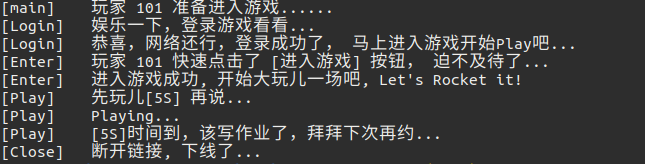

# GMMO 
[GMMO](https://github.com/HuluoluoTech/gmmo) is shortened form of General Massively Multiplayer Online. 

status : pre-release

## How to run
### Server-Side
[Tutorial](./docs/tutorial.md)

### Client(Python3)-Side
```python
python3 client.py
```
### Client Output


## Links
* [million_game_server](https://github.com/luopeiyu/million_game_server)
* [skynet api](https://github.com/cloudwu/skynet/wiki/LuaAPI)

## Others
Based on [million_game_server](https://github.com/luopeiyu/million_game_server).
